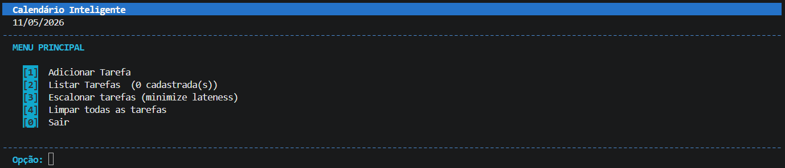
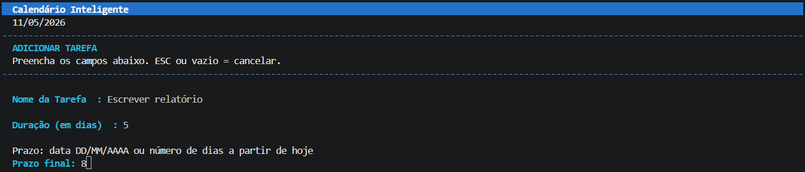
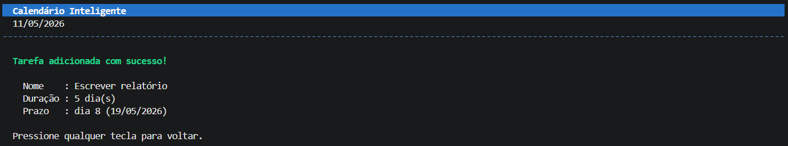
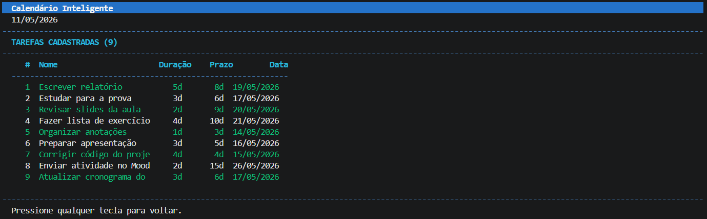
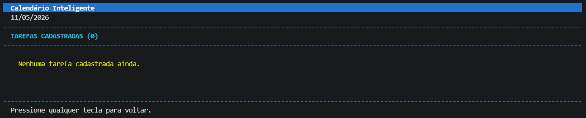
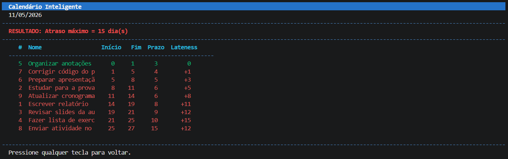
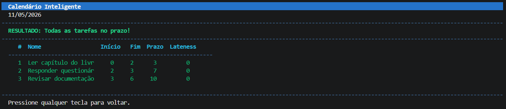
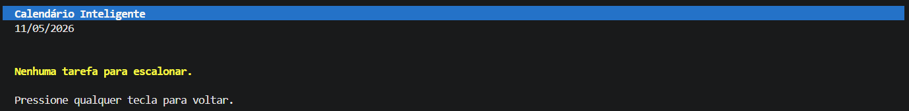
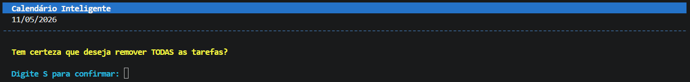
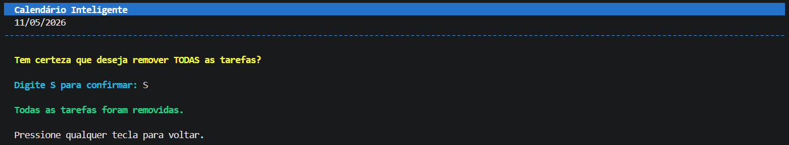

# Calendário Inteligente

**Número da Lista**: 2 
**Conteúdo da Disciplina**: Algoritmos Ambiciosos 

## Alunos
| Matrícula | Aluno |
| -- | -- |
| 23/1011220 | Davi Camilo Menezes |
| 23/1011800 | Rafael Welz Schadt |

## Sobre
Descreva os objetivos do seu projeto e como ele funciona. 

## Screenshots
A seguir estão imagens do projeto em funcionamento.

- Menu principal (com todas as funcionalidades):

- Adicionar uma tarefa:

- Visualizar tarefas cadastradas:

> Caso não haja tarefa cadastrada.

- Agendamento para minimizar o atraso (cálculo do atraso máximo):

> Situação em que existe atraso.

> Situação em que não existe atraso.

> Caso não haja tarefas para escalonar.

- Excluir todas as tarefas

## Instalação
**Linguagem**: Python 
**Framework**: Não foi utilizado 
**Pré-requisitos:**  

### Como rodar

...

## Uso
Como mostrado nas screenshots do trabalho, ao iniciar o programa, o usuário terá acesso ao menu principal com as seguintes opções:

1. **Adicionar Tarefa**: cadastra uma nova tarefa informando nome, duração em dias e prazo final;
2. **Listar Tarefas**: exibe todas as tarefas cadastradas;
3. **Escalonar tarefas**: aplica o algoritmo ambicioso e mostra a ordem de execução, o início, o fim, o prazo e o atraso de cada tarefa, indicando ainda o atraso máximo (caso houver);
4. **Limpar todas as tarefas**: remove os dados que foram cadastrados durante a execução;
5. **Sair**: encerra o programa.

O prazo pode ser informado de duas formas:

- por uma data no formato `DD/MM/AAAA`;
- por um número inteiro, representando a quantidade de dias a partir da data atual.

## Vídeo de Apresentação
Link para o vídeo de apresentação e demonstração do trabalho: [Clique aqui]()
